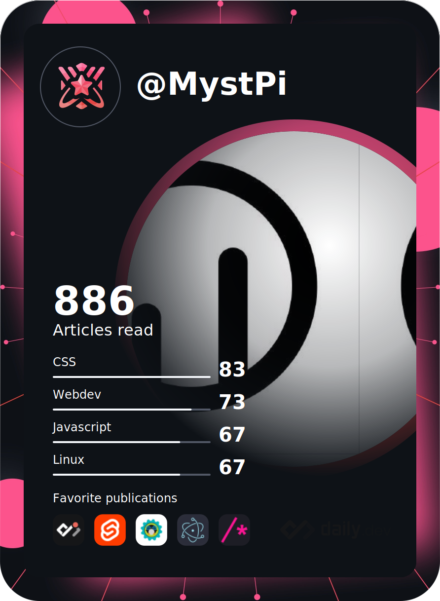

# Hi there; I'm MystPi! 👋

<a href="https://app.daily.dev/MystPi"></a>

```py
class MystPi:
    def __init__(self):
        self.username = 'MystPi'
        self.type = 'Full stack developer'
        self.langs = [
            'Python',
            'JavaScript',
            'HTML & CSS',
        ]
        self.tech = [
            'Svelte & SvelteKit',
            'React',
            'Tailwind CSS',
            'Language development',
            'Electron',
            '... and more!'
        ]
        
    def display_langs(self):
        print('== Languages ==')
        display_list(self.langs)
            
    def display_tech(self):
        print('== Tech Stack ==')
        display_list(self.tech)
        
me = MystPi()
me.display_langs()
me.display_tech()
```

<!-- 
 -->
